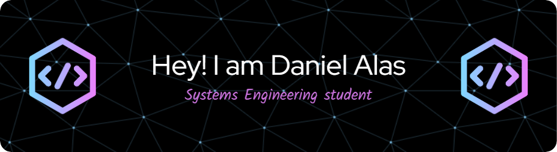

- 🌱 I’m currently learning **full stack development**

- 🤝 I’m looking for help with **web projects**

- 💬 Ask me about **html, css and python**

- 📫 How to reach me **alasalexander76@gmail.com**

- ⚡ Fun fact **I think I'm funny**

<h3 align="left">Connect with me:</h3>

<h3 align="left">Languages and Tools:</h3>

         

